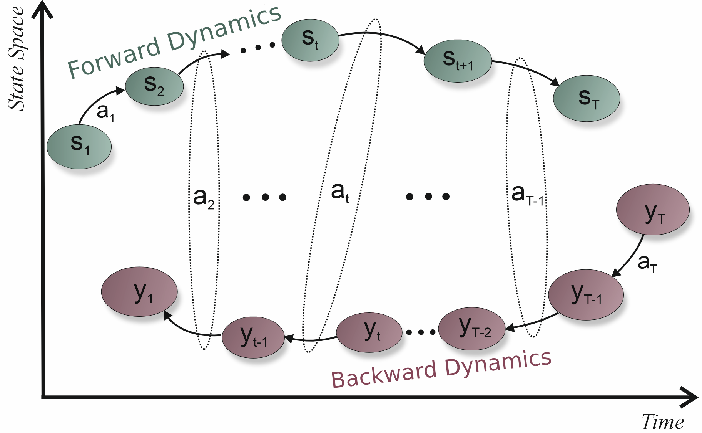
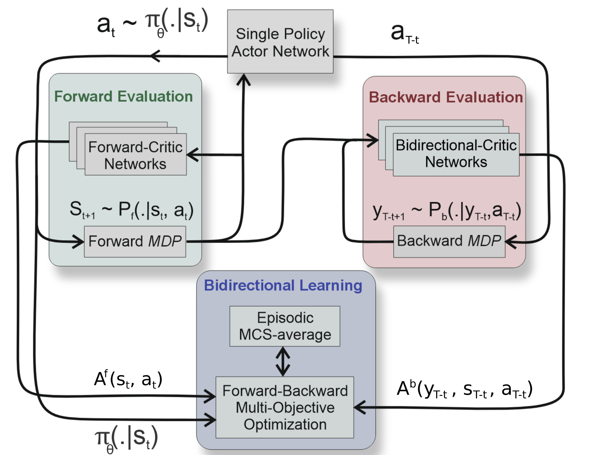
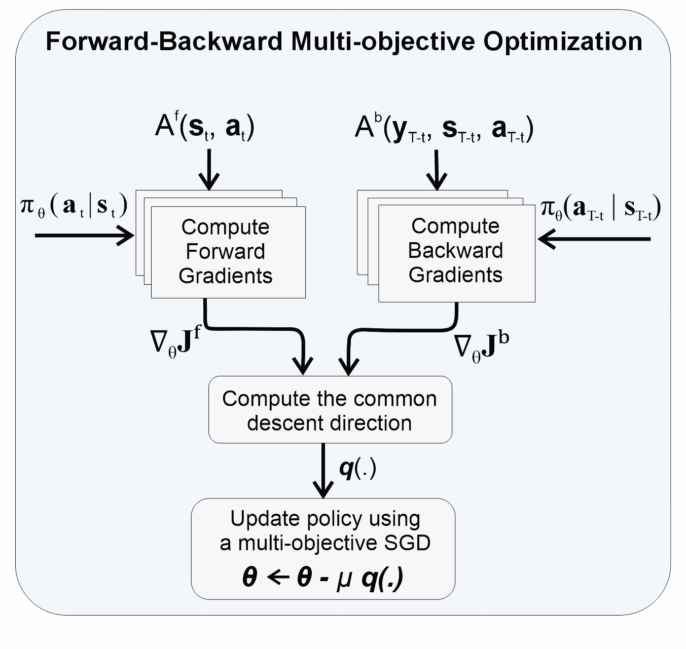

# Reinforcement Learning Algorithms for Forward-Backward Markov Decision Processes
In this project, the notion of forward-backward Markov decision processes (FB-MDPs) is introduced, for the first time, and its application has been studied.
We develop new RL theory for this project, and devise nolve bidirectional learning algorithm sitable to FB-MDPs.
We also discover the connection between FB-MDPs and forward-backward stochastic differentil equations.

|  An examplery illustration of a FB-MDP.  |
| :-------------------------:|
|  |
|forward states **$s_t$** and backward states  **y_t** apply the same actions **a_t**, but with a different ordering in time. Moreover, FB-MDPs includes forward transition probability determining the evolution of the forward state and backward transition probability specifying the evolution of the backward state.|

|  Diagram of FB-MOAC, an RL algorithm for FB-MDPs |  Forward-Backward Multi-Objective Optimization mechanism of FB-MOAC  |
| :-------------------------:| :-------------------------:|
|    |   |
| The FB-MOAC algorithm consists **forward evaluation**, **backward evaluation** and **bidirectional learning** steps. During the first two steps, the forward and backward dynamics are evaluated, using forward/backward critics, and the resulting experiences are buffered. By a proper chronological order, the policy distribution is optimized in the bidirectional learning step based on the experiences of both forward and backward dynamics and using a **forward-backward multi-objective learning**. The algorithm is additionally equipped with an add-on **episodic MCS-average** to boost the convergence to Pareto-optimal solutions. | This step first computes the vector-valued gradients of forward and backward objectives, then compute the descent direction q(\.) to ensure that all rewards increase simultaneously,  and finally update the parameters of actor network based on q(.).|

[publication](https://openreview.net/pdf?id=li5DyC6rfS)

# Malliavin-based Iterative Algorithm for Stochastic Optimal Control Problems.

# Multi-Objective Deep Learning Algorithms for Stochastic Optimal Control Problems with Forward-Backward Dynamics.
